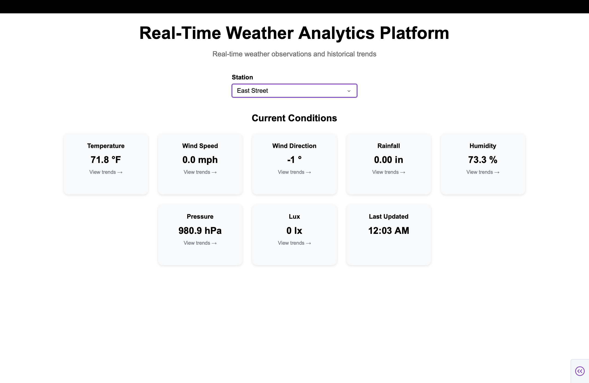
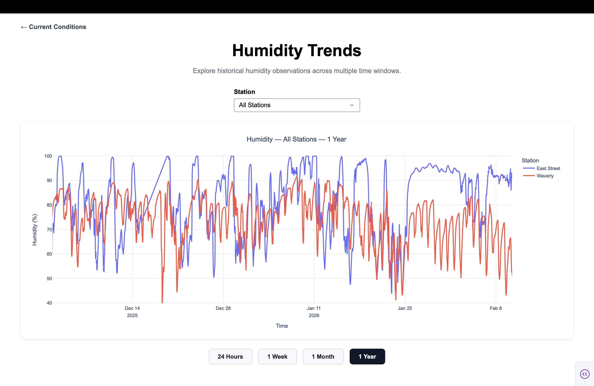
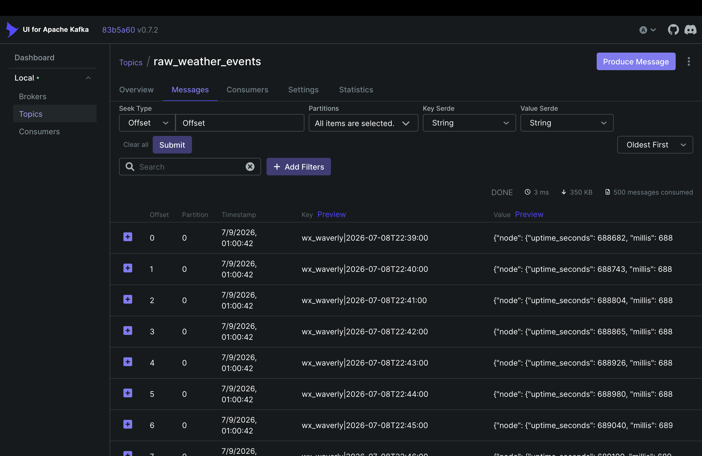

# Real-Time Weather Analytics Platform


A real-time weather analytics platform that continuously ingests live weather observations from remote weather stations, streams new observations through Apache Kafka, stores historical and latest-state weather data in PostgreSQL, precomputes analytical aggregates, exposes REST APIs with FastAPI, and visualizes live and historical weather data using an interactive Plotly Dash dashboard.

---

# Architecture

```text
Weather Stations
        │
        ▼
Initial Backfill
        │
        ▼
Kafka Producer
        │
        ▼
Apache Kafka
        │
        ▼
Kafka Consumer
        │
        ▼
PostgreSQL
        │
        ├────────► weather
        ├────────► weather_latest
        └────────► weather_aggregates
                     │
                     ▼
               FastAPI REST API
                     │
                     ▼
             Plotly Dash Dashboard
```

---

# Features

- Real-time weather data ingestion
- Apache Kafka event streaming
- Incremental event publishing using producer checkpoints
- PostgreSQL historical and latest-state storage
- Precomputed historical aggregates
- REST APIs with FastAPI
- Interactive Plotly Dash dashboard
- Dockerized infrastructure
- Configuration using environment variables

---

# Technology Stack

| Component | Technology |
|-----------|------------|
| Language | Python |
| Streaming | Apache Kafka |
| Database | PostgreSQL |
| API | FastAPI |
| Dashboard | Plotly Dash |
| Visualization | Plotly |
| Data Processing | Pandas |
| Web Scraping | BeautifulSoup |
| Containers | Docker Compose |

---

# Dashboard

## Current Weather

> Replace this placeholder with a screenshot.



---

## Historical Trends

> Replace this placeholder with a screenshot.




---

## Kafka UI

> Replace this placeholder with a screenshot.



---

# Project Structure

```text
Weather-Analytics-Platform/

dashboard/
config.py
docker-compose.yml
run_platform.py
initial_backfill.py
weather_kafka_producer.py
weather_kafka_consumer.py
weather_aggregation_postgres.py
weather_api.py
requirements.txt
README.md
```

---

# Running the Project

Start Docker services

```bash
docker compose up -d
```

Run the initial historical backfill

```bash
python initial_backfill.py
```

Start the platform

```bash
python run_platform.py
```

Available services

| Service | URL |
|----------|-----|
| Dashboard | http://127.0.0.1:8050 |
| FastAPI Docs | http://127.0.0.1:8000/docs |
| Kafka UI | http://127.0.0.1:8080 |

---

# Skills Demonstrated

- Real-Time Data Engineering
- Apache Kafka
- PostgreSQL
- Incremental ETL Pipelines
- Event-Driven Architecture
- REST API Development
- Interactive Dashboard Development
- Docker
- Configuration Management
- End-to-End Data Pipeline Design

---

# Future Enhancements

- Azure deployment
- Kubernetes orchestration
- Apache Airflow scheduling
- CI/CD with GitHub Actions
- Prometheus & Grafana monitoring

---

# License

This project is intended for educational and portfolio purposes.